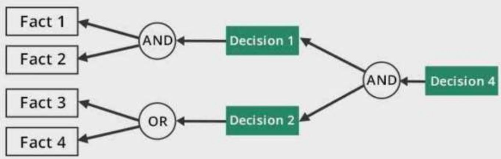
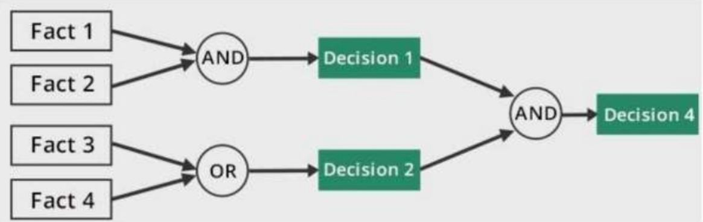

# Artificial Intelligence CS-101

This repository contains all the classes' activities done in the semester. These include:
- Solving 8-puzzle
- Backwards and Forwards chainning
- Recommender System


## Getting Started

### Prerequisites
You should have the basic installation of Python-3 installed, no third-party library is required.

Although it has not been tested under Python-2, it might run without a hitch.

## Projects

### 8-Puzzle


Solved by using Bread-first search and Depth-First search algorithms.

There is no installation procedure, just execute the file you wish to test.

To execute the game, just type:
```
  python 8puzzle/game.py
```

The game solution is displayed backwards, i.e. the first table state printed is actually the last one.
It also prints the number os iterations and a list of moves to reach the goal.

### Backward and Forward Chainning
After executing one of the chainning files you should provide the following arguments:
- List of rules
  ```
  ((p&q)#r)#(s&t)=>c;g#h=>x;s&(c#j)=>h
  ```
- List of facts
  ```
  s, t
  ```

- A goal
  ```
  x
  ```

Bellow you can see a overview of how each one works.
#### Backward Chainning


#### Forward Chainning


### Recommender System

Item-based collaborative filtering is a form of collaborative filtering for recommender systems based on the similarity between items calculated using people's ratings of those items.

You can see more information such a related works and implementation in the README inside the recommender folder.

### Image Credits
- 8 puzzle:
 https://kartikkukreja.wordpress.com/2015/06/14/heuristics-in-ai-search/
- Chainnings:
  QAU ISLAMABAD,PAKISTAN
  https://www.slideshare.net/quratarmy/forward-backward-chaining-60997177
- Recommender System:
  Recommender System (Machine Learning Summer School 2014 @ CMU)
  https://www.slideshare.net/xamat/recommender-systems-machine-learning-summer-school-2014-cmu
- Pearson Correlation
http://www.dataanalytics.org.uk/Publications/S4E2e%20Support/exercises/spearman.htm
